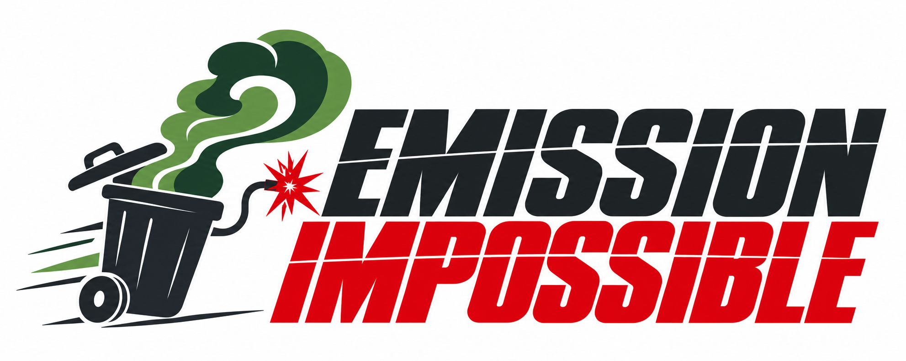

# Emission Impossible

  

Exploring the relationship between **greenhouse gas emissions and waste** as part of the [What a Waste 3.0 Global Data Hack](../../README.md).

## Project overview

How do waste generation and management relate to greenhouse gas emissions, and what can the data tell us about opportunities to reduce their climate impact?

We will explore this relationship using the World Bank's *What a Waste 3.0* data, potentially alongside complementary emissions datasets. Our aim is to turn the data into clear insights and visualisations that support discussion and further investigation.

**Status: early exploration.** We will refine our research questions, scope and outputs as we learn what the data can support.

## Team

- Catriona
- Madhu
- Perinaz
- Kartik
- Garry

## Possible research questions

These are starting points, rather than a fixed project scope:

- How does waste generation relate to greenhouse gas emissions across countries or regions?
- How do different waste management practices relate to emissions?
- How do the patterns change when comparing total and per-capita measures?
- Where might the data point to opportunities for lower-emission waste management?

## Data sources

| Source | Planned use | Status |
| --- | --- | --- |
| World Bank *What a Waste 3.0* data | Explore waste generation, composition and management indicators | Starting dataset; relevant fields to be reviewed |
| Complementary greenhouse gas emissions data | Add emissions measures appropriate to our research question | Sources to be identified and assessed |

As we select datasets, we will record their links, versions, coverage, units and licensing information here. Shared datasets and references belong in the repository's [data directory](../../data/README.md).

## Proposed methodology

1. Review the available data and agree a focused research question.
2. Check coverage, missing values and comparability across places and years.
3. Define the emissions measures we are studying, including whether they describe the waste sector or wider economy.
4. Clean and combine suitable datasets, aligning geography, time periods and units.
5. Explore patterns through summary statistics and visualisations, considering factors such as population and income where relevant.
6. Document findings, limitations and questions for further work.

We will distinguish observed relationships from evidence of causation and make any assumptions explicit.

## Findings

No findings yet. This section will capture the main results, supporting evidence and limitations as the analysis develops.

## Outputs

Links to notebooks, visualisations, dashboards or presentations will be added here as they are created. The final format will follow the needs of the project.

## Working in this repository

Keep project-specific code, analysis and outputs in `projects/emission-impossible/`. See the [projects guide](../README.md) for submission expectations and the [repository README](../../README.md) for the overall hackathon structure.

Setup and run instructions will be added once we have chosen our tools.
